<details>
  <summary><h1>English</h1></summary>
    
## Human Personality Classification

This project analyzes and models personality types (Extrovert vs. Introvert) based on behavioral and social features. It includes data preprocessing, feature engineering, model training, evaluation, and visualization pipelines organized for scalability and reproducibility.

## Dataset Overview

* **Rows**: \~2,900
* **Columns**:

  * `Time_spent_Alone`: Hours spent alone daily (0–11)
  * `Stage_fear`: Presence of stage fright (`Yes`/`No`)
  * `Social_event_attendance`: Frequency of social events (0–10)
  * `Going_outside`: Frequency of going outside (0–7)
  * `Drained_after_socializing`: Feeling drained after socializing (`Yes`/`No`)
  * `Friends_circle_size`: Number of close friends (0–15)
  * `Post_frequency`: Social media post frequency (0–10)
  * `Personality`: Target label (`Extrovert`/`Introvert`)

---

## Prerequisites

* Python 3.9+
* `pip install -r requirements.txt` (see [requirements.txt](requirements.txt))
* Docker (optional)
* Jupyter Notebook / VS Code
* Scikit-learn, pandas, seaborn, matplotlib

---

## Project Structure

```
Human-Personality/
├── Dockerfile
├── README.md
├── requirements.txt
├── src/human_personality/
│   ├── data/make_dataset.py
│   ├── features/build_features.py
│   ├── models/train_model.py
│   ├── models/evaluate_model.py
├── scripts/               # Quick pipeline executables
│   ├── run_data_prep.sh
│   ├── run_features.sh
│   └── run_train.sh
├── figures/               # Generated plots and charts
```

---

## Quick Start

1. **Prepare data**:

   ```bash
   bash scripts/run_data_prep.sh
   bash scripts/run_features.sh
   ```
2. **Train model**:

   ```bash
   bash scripts/run_train.sh
   ```
3. **Evaluate**:

   ```python
   bash scripts/run_test.sh
   ```

<details>
  <summary><h2>Visualizations</h2></summary>
    
### Feature Distribution & Pairplot

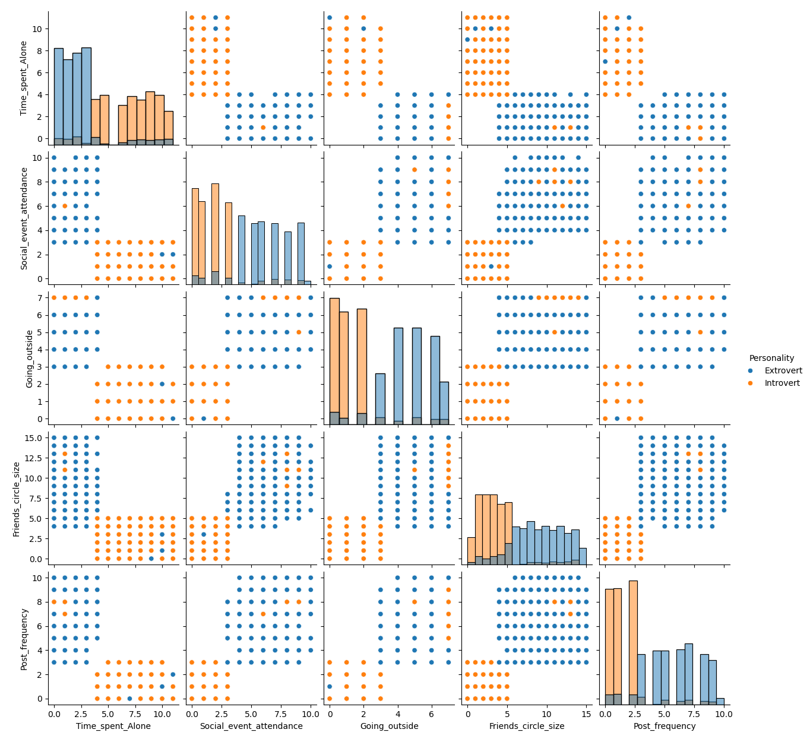

### Model Comparison

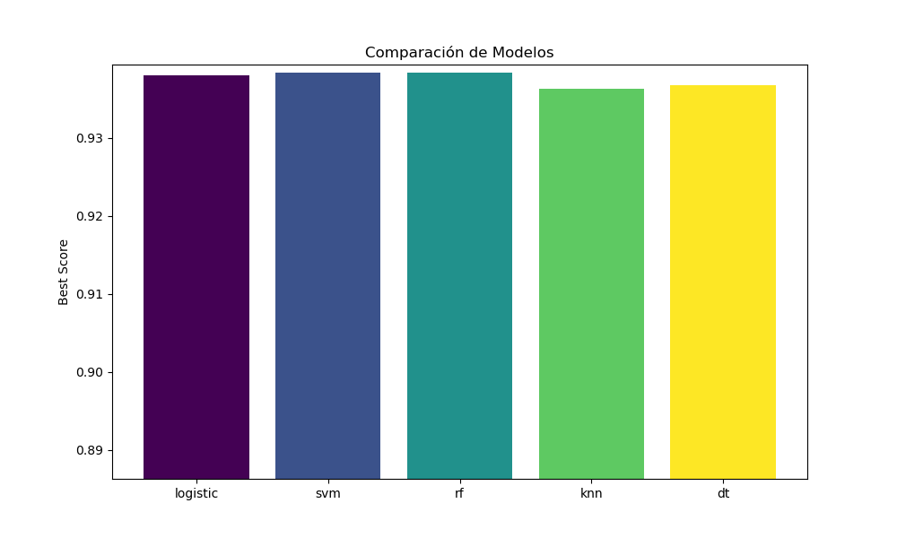

### Learning Curve

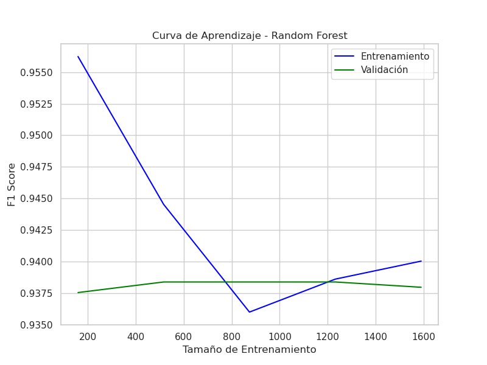

### ROC Curve

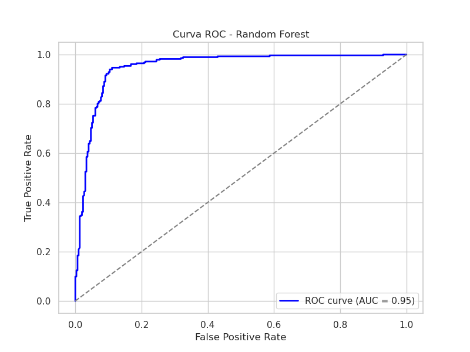

### Boxplots by Category

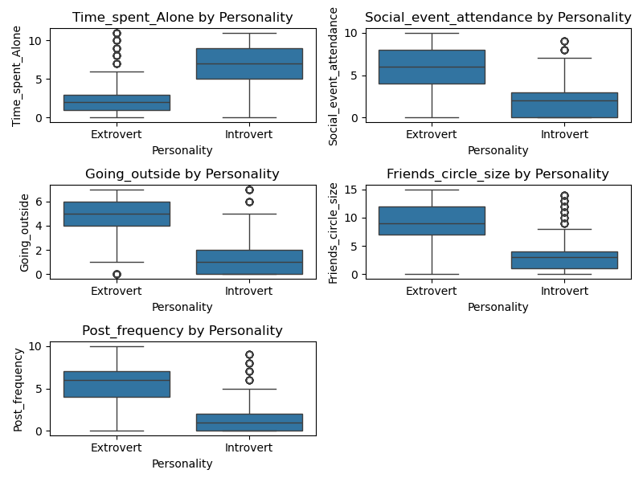

### True vs. Predicted Distribution

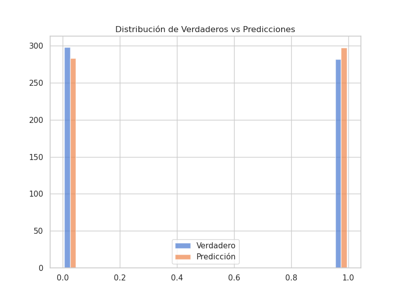

### Correlation Heatmap

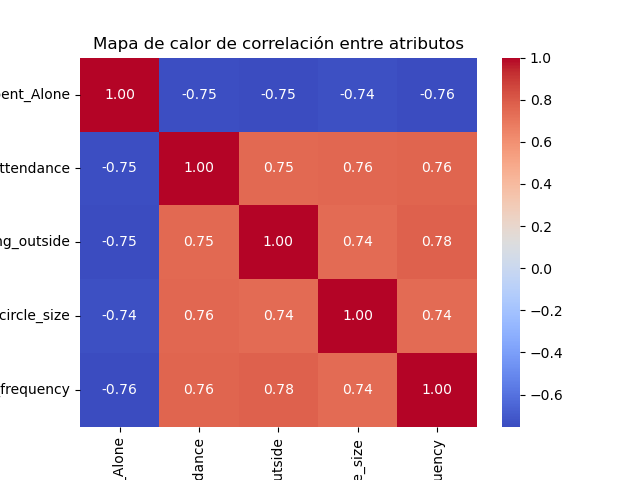

### Confusion Matrix

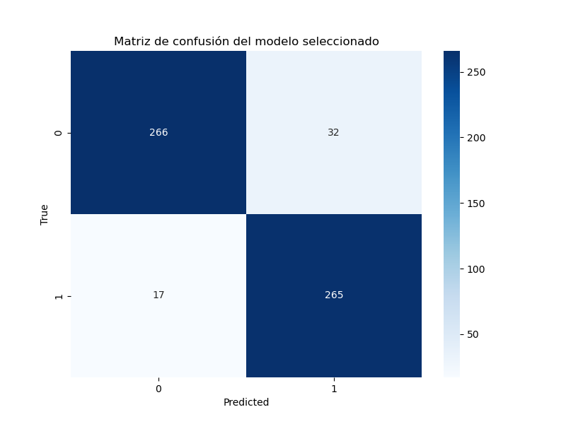

### Cross-Validation Scores

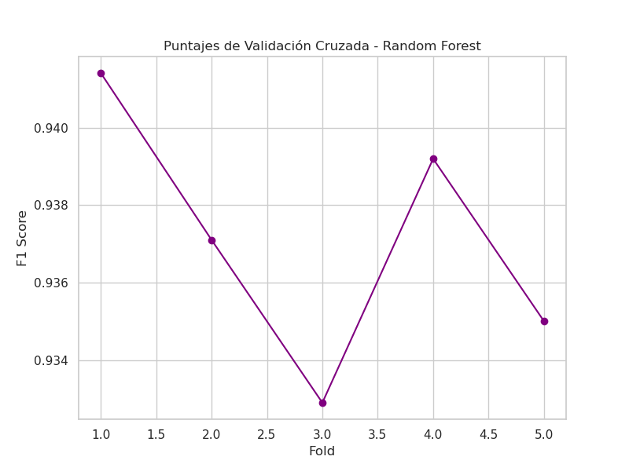

### Feature Importances

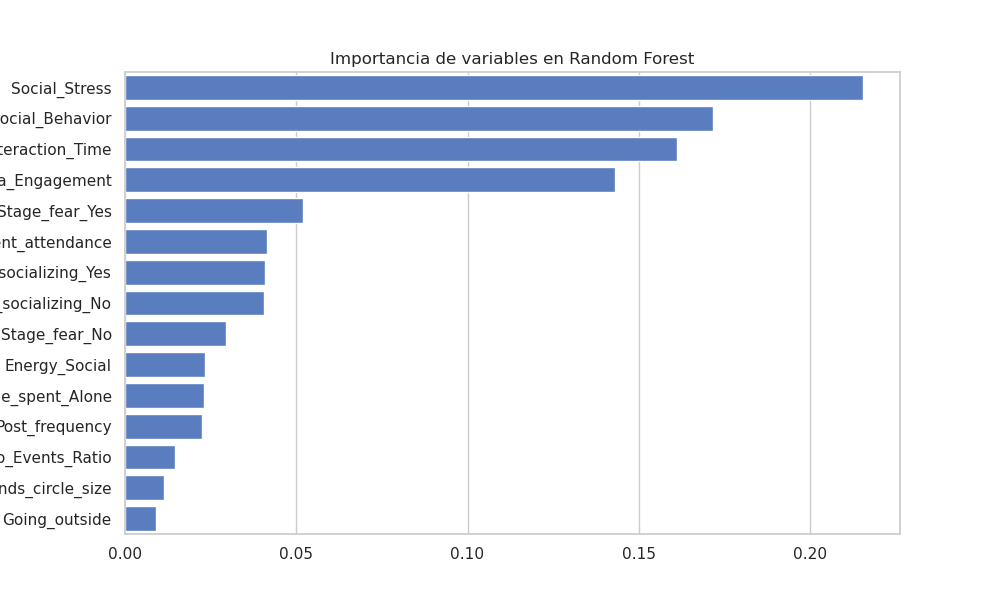

</details>

---

## Results Highlights

* **Model Comparison**: Random Forest achieved the highest weighted F1 score (\~0.95).
* **Learning Curve**: Balanced training and validation F1 scores, no significant overfitting.
* **ROC Curve**: AUC ≈ 0.95 indicates strong discriminative performance.
* **Confusion Matrix**: Low false positives/negatives (17 introverts misclassified, 32 extroverts misclassified).
* **Feature Importances**: Top features include `Social_Stress`, `Social_Behavior`, and `Interaction_Time`.

</details>

---

<details>
  <summary><h1>Español</h1></summary>

## Clasificación de Personalidad Humana

Este proyecto analiza y modela tipos de personalidad (Extrovertido vs. Introvertido) basándose en características de comportamiento y sociales. Incluye pipelines de preprocesamiento de datos, ingeniería de características, entrenamiento y evaluación de modelos, así como visualizaciones.

## Descripción del Conjunto de Datos

* **Filas**: \~2,900
* **Columnas**:

  * `Time_spent_Alone`: Horas diarias en soledad (0–11)
  * `Stage_fear`: Presencia de miedo escénico (`Yes`/`No`)
  * `Social_event_attendance`: Frecuencia de eventos sociales (0–10)
  * `Going_outside`: Frecuencia de salir al exterior (0–7)
  * `Drained_after_socializing`: Sensación de agotamiento tras socializar (`Yes`/`No`)
  * `Friends_circle_size`: Número de amigos cercanos (0–15)
  * `Post_frequency`: Frecuencia de publicaciones en redes (0–10)
  * `Personality`: Etiqueta objetivo (`Extrovert`/`Introvert`)

---

## Requisitos Previos

* Python 3.9+
* `pip install -r requirements.txt`
* Docker (opcional)

---

## Estructura del Proyecto

```
Human-Personality/
├── Dockerfile
├── README.md
├── requirements.txt
├── src/human_personality/
│   ├── data/make_dataset.py
│   ├── features/build_features.py
│   ├── models/train_model.py
│   ├── models/evaluate_model.py
│   └── utils.py
├── scripts/               # Ejecución rápida de pipelines
│   ├── run_data_prep.sh
│   ├── run_features.sh
│   └── run_train.sh
├── figures/               # Gráficos y visualizaciones generados
```

---

## Inicio Rápido

1. **Preparar datos**:

   ```bash
   bash scripts/run_data_prep.sh
   bash scripts/run_features.sh
   ```
2. **Entrenar modelo**:

   ```bash
   bash scripts/run_train.sh
   ```
3. **Evaluar**:

   ```python
   bash scripts/run_test.sh
   ```
<details>
    

<summary><h2>Visualizaciones</h2></summary>

En esta sección se muestran las imágenes clave generadas y su ruta dentro del proyecto:

* **Distribución & Pairplot**
  `figures/catNumRespecto_Personalidad.png`

  ```markdown
  
  ```
* **Comparación de Modelos**
  `figures/comparacionModelos.png`

  ```markdown
  
  ```
* **Curva de Aprendizaje**
  `figures/curvaAprendizajeRF.png`

  ```markdown
  
  ```
* **Curva ROC**
  `figures/curvaROC_RF.png`

  ```markdown
  
  ```
* **Mapa de Calor de Correlación**
  `figures/mapaCalorCorrelacion.png`

  ```markdown
  
  ```
* **Matriz de Confusión Normalizada**
  `figures/matrizConfusionResultadosNormalizada.png`

  ```markdown
  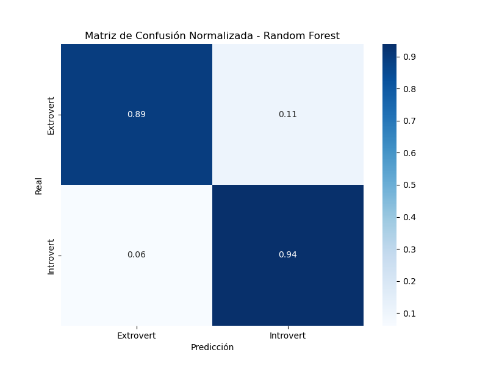
  ```
* **Importancia de Variables**
  `figures/varImportantesRF.png`

  ```markdown
  
  ```
</details>

---

## Resultados Destacados

* **Comparación de Modelos**: Random Forest obtuvo el mejor F1 ponderado (\~0.95).
* **Curva de Aprendizaje**: F1 equilibrado entre entrenamiento y validación, sin sobreajuste.
* **Curva ROC**: AUC ≈ 0.95 indica excelente capacidad discriminativa.
* **Matriz de Confusión**: Bajos falsos positivos/negativos (17 introvertidos mal clasificados, 32 extrovertidos mal clasificados).
* **Importancia de Variables**: Las top incluyen `Social_Stress`, `Social_Behavior` e `Interaction_Time`.

</details>