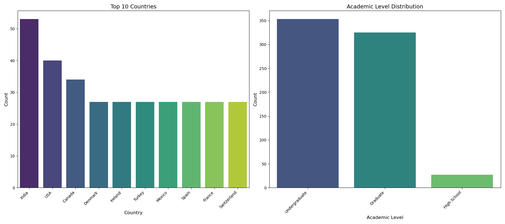
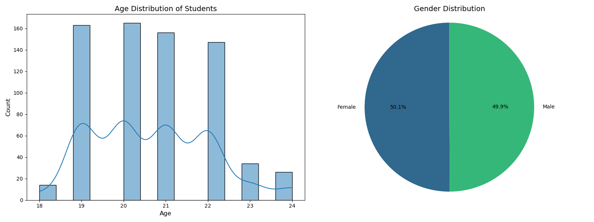
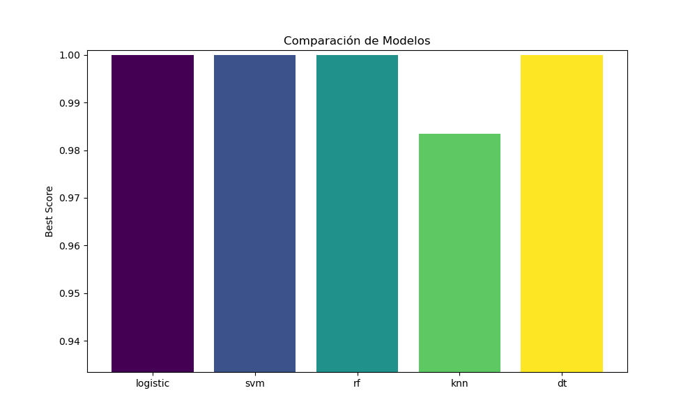
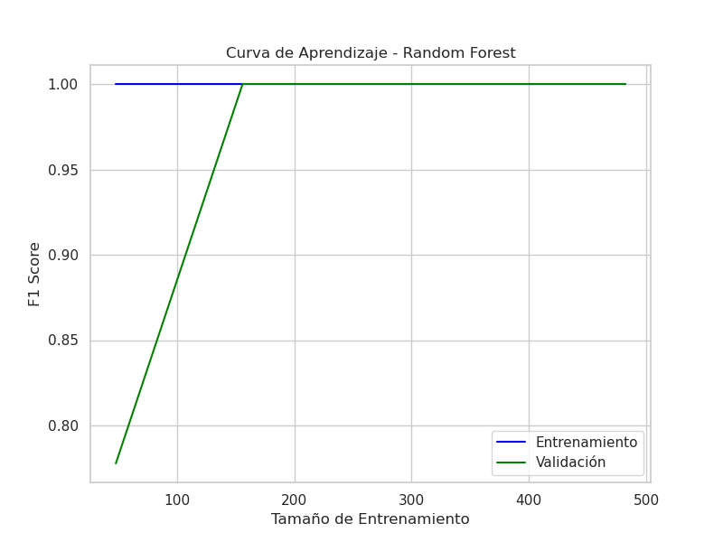
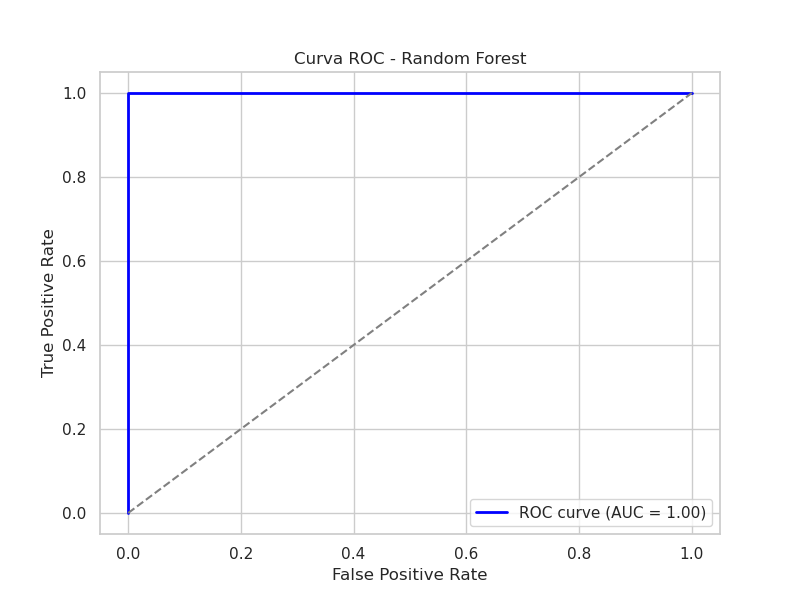
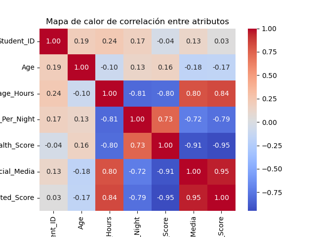
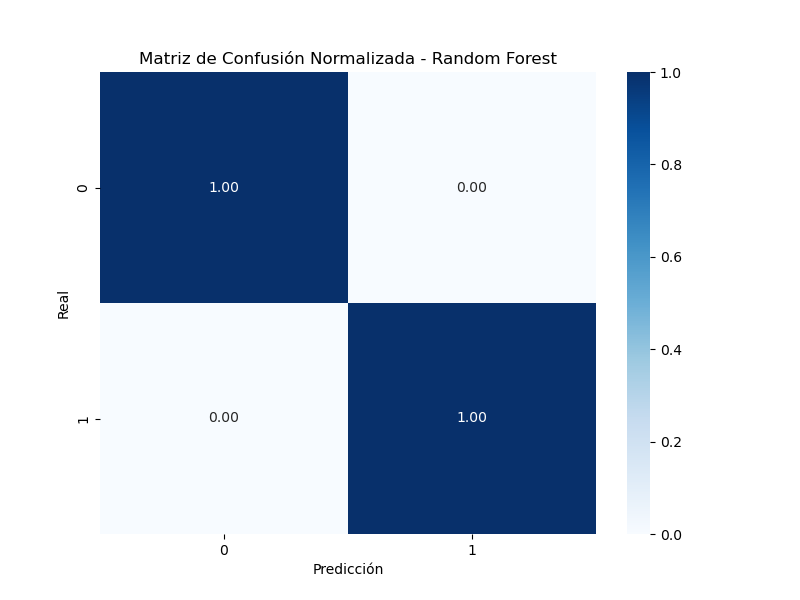
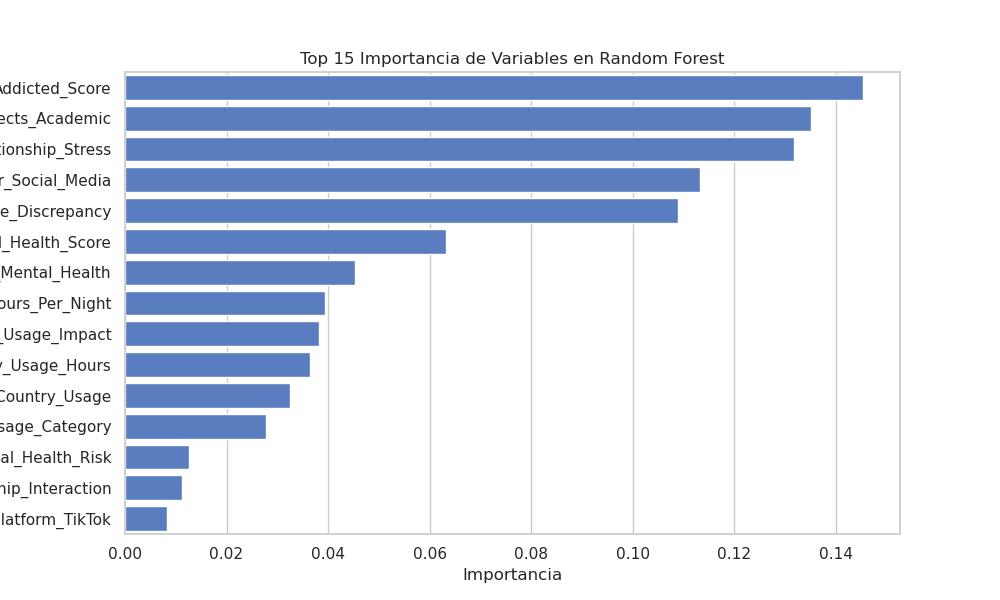
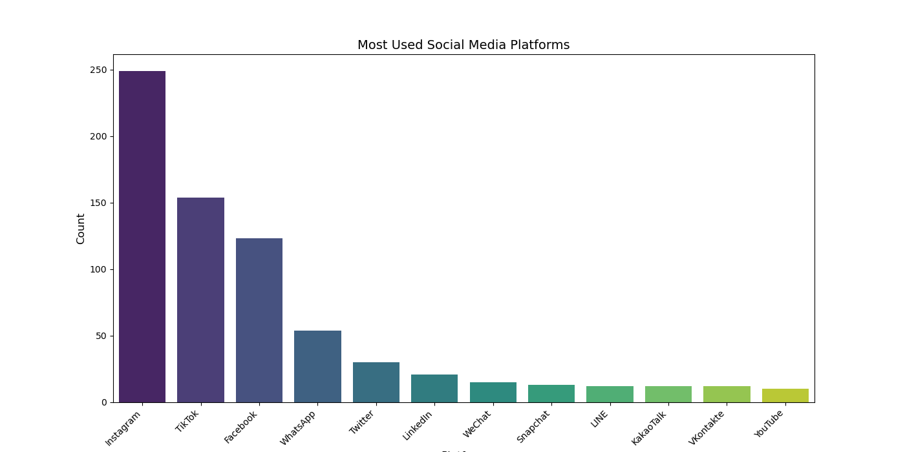

<details>
  <summary><h1>English</h1></summary>

# Student Social Media Addiction Analysis

This project investigates how social media usage impacts students' academic performance and mental well-being across countries and academic levels. It uses a rich survey-based dataset and applies machine learning to identify behavioral patterns and predictive factors.

---

## Dataset Overview

* **Rows**: \~700 (configurable)
* **Columns**:

  * `Age`, `Gender`, `Country`, `Academic_Level`
  * `Avg_Daily_Usage_Hours`, `Most_Used_Platform`
  * `Sleep_Hours_Per_Night`, `Mental_Health_Score`
  * `Addicted_Score`, `Conflicts_Over_Social_Media`
  * `Affects_Academic_Performance` (target variable)

---

## Prerequisites

* Python 3.9+
* `pip install -r requirements.txt`  (see [requirements.txt](requirements.txt))
* Jupyter Notebook / VS Code
* Scikit-learn, pandas, seaborn, matplotlib
* Docker (optional)

---

## Project Structure

```
Student-Social-Media-Addiction/
├── Dockerfile
├── README.md
├── requirements.txt
├── src/student-social-media/
│   ├── data/make_dataset.py
│   ├── features/build_features.py
│   ├── models/train_model.py
│   ├── models/evaluate_model.py
├── scripts/               # Quick pipeline executables
│   ├── run_data_prep.sh
│   ├── run_features.sh
│   └── run_train.sh
├── figures/               # Generated plots and charts
```

---

## Quick Start

1. **Prepare data**:

   ```bash
   bash scripts/run_data_prep.sh
   bash scripts/run_features.sh
   ```
2. **Train model**:

   ```bash
   bash scripts/run_train.sh
   ```
3. **Evaluate**:

   ```python
   bash scripts/run_test.sh
   ```

Sure! Here's the same markdown section translated into English and adapted accordingly:

<summary><h2>Visualizations</h2></summary>

This section presents the key generated figures and their paths within the project:

* **Age and Gender Distribution**  
  `figures/Age_Gender_Distribution.png`

  ```markdown
  
  ```

* **Model Comparison**
  `figures/comparacionModelos.png`

  ```markdown
  
  ```

* **Country and Academic Level Distribution**
  `figures/Country_AcademicLev_Distribution.png`

  ```markdown
  
  ```

* **Learning Curve**
  `figures/curvaAprendizajeRF.png`

  ```markdown
  
  ```

* **ROC Curve**
  `figures/curvaROC_RF.png`

  ```markdown
  
  ```

* **Correlation Heatmap**
  `figures/mapaCalorCorrelacion.png`

  ```markdown
  
  ```

* **Normalized Confusion Matrix**
  `figures/matrizConfusionResultadosNormalizada.png`

  ```markdown
  
  ```

* **Feature Importance**
  `figures/varImportantesRF.png`

  ```markdown
  
  ```

* **Most Used Social Media Platforms**
  `figures/Most_Used_Social_Media_Distribution.png`

  ```markdown
  
  ```

</details>

---

## Results Highlights

* **Key Predictors**: `Addicted_Score`, `Conflicts_Over_Social_Media`, and `Mental_Health_Score` were the strongest predictors of academic performance.
* **Model Performance**: The Random Forest classifier achieved perfect classification in testing (100% accuracy based on normalized confusion matrix).
* **Correlations**: Negative correlations between mental health and both social media use and addiction.
* **Demographics**:

  * Gender distribution is nearly equal.
  * Most students are undergraduates, primarily from India, USA, and Canada.
* **Platform Popularity**: Instagram and TikTok dominate as most-used platforms.

---

## Conclusion

The project reveals a strong link between social media addiction and academic challenges. High usage correlates with lower sleep, more relationship conflicts, and diminished mental health. The predictive models provide a reliable framework to classify students at risk, guiding potential interventions.

</details>

---

<details>
  <summary><h1>Español</h1></summary>

# Análisis de Adicción a Redes Sociales en Estudiantes

Este proyecto analiza cómo el uso de redes sociales afecta el rendimiento académico y el bienestar mental de estudiantes, abarcando distintos países y niveles académicos. Utiliza datos de encuestas y aplica modelos de machine learning para identificar patrones de comportamiento.

---

## Descripción del Conjunto de Datos

* **Filas**: \~700 (ajustable)
* **Columnas**:

  * `Age`, `Gender`, `Country`, `Academic_Level`
  * `Avg_Daily_Usage_Hours`, `Most_Used_Platform`
  * `Sleep_Hours_Per_Night`, `Mental_Health_Score`
  * `Addicted_Score`, `Conflicts_Over_Social_Media`
  * `Affects_Academic_Performance` (variable objetivo)

---

## Requisitos Previos

* Python 3.9+
* `pip install -r requirements.txt`  (see [requirements.txt](requirements.txt))
* Jupyter Notebook / VS Code
* Scikit-learn, pandas, seaborn, matplotlib
* Docker (optional)

---

## Estructura del Proyecto

```
Student-Social-Media-Addiction/
├── Dockerfile
├── README.md
├── requirements.txt
├── src/student-social-media/
│   ├── data/make_dataset.py
│   ├── features/build_features.py
│   ├── models/train_model.py
│   ├── models/evaluate_model.py
├── scripts/               # Quick pipeline executables
│   ├── run_data_prep.sh
│   ├── run_features.sh
│   └── run_train.sh
├── figures/               # Generated plots and charts
```

---

## Inicio Rápido

1. **Preparar datos**:

   ```bash
   bash scripts/run_data_prep.sh
   bash scripts/run_features.sh
   ```
2. **Entrenar modelo**:

   ```bash
   bash scripts/run_train.sh
   ```
3. **Evaluar**:

   ```python
   bash scripts/run_test.sh
   ```

Claro, aquí tienes el bloque en formato markdown con las imágenes más relevantes que aparecen en tu proyecto, siguiendo exactamente la estructura que me diste:

<summary><h2>Visualizaciones</h2></summary>

En esta sección se muestran las imágenes clave generadas y su ruta dentro del proyecto:

* **Distribución de Edad y Género**  
  `figures/Age_Gender_Distribution.png`

  ```markdown
  
  ```

* **Comparación de Modelos**
  `figures/comparacionModelos.png`

  ```markdown
  
  ```

* **Distribución por País y Nivel Académico**
  `figures/Country_AcademicLev_Distribution.png`

  ```markdown
  
  ```

* **Curva de Aprendizaje**
  `figures/curvaAprendizajeRF.png`

  ```markdown
  
  ```

* **Curva ROC**
  `figures/curvaROC_RF.png`

  ```markdown
  
  ```

* **Mapa de Calor de Correlación**
  `figures/mapaCalorCorrelacion.png`

  ```markdown
  
  ```

* **Matriz de Confusión Normalizada**
  `figures/matrizConfusionResultadosNormalizada.png`

  ```markdown
  
  ```

* **Importancia de Variables**
  `figures/varImportantesRF.png`

  ```markdown
  
  ```

* **Plataformas Más Usadas**
  `figures/Most_Used_Social_Media_Distribution.png`

  ```markdown
  
  ```

</details>


---

## Resultados Destacados

* **Variables Clave**: `Addicted_Score`, `Conflicts_Over_Social_Media` y `Mental_Health_Score` fueron las más relevantes para predecir el rendimiento académico.
* **Rendimiento del Modelo**: El clasificador Random Forest logró una clasificación perfecta en el conjunto de prueba (matriz de confusión normalizada al 100%).
* **Correlaciones**: La salud mental se correlaciona negativamente con el uso y adicción a redes sociales.
* **Demografía**:

  * Distribución de género casi equitativa.
  * Mayoría estudiantes de pregrado, principalmente de India, EE. UU. y Canadá.
* **Plataformas Más Usadas**: Instagram y TikTok lideran por amplio margen.

---

## Conclusión

El proyecto muestra una relación significativa entre la adicción a redes sociales y los problemas académicos. El alto uso se asocia con menos sueño, más conflictos en relaciones y deterioro en la salud mental. Los modelos predictivos permiten clasificar con precisión a los estudiantes en riesgo, brindando una base sólida para futuras intervenciones.

</details>